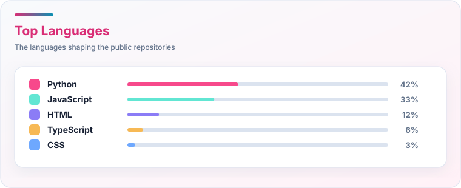
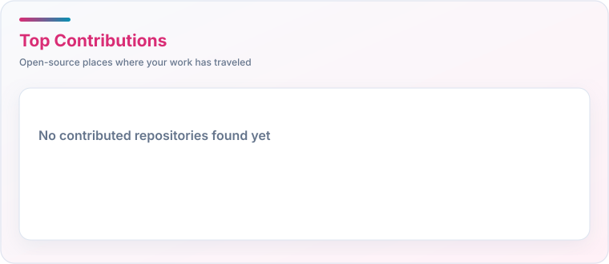

  

 

  
  
  

<h2 align="left">👩‍💻 About Me</h2>

<h3 align="center">A friendly web developer from Vietnam 🇻🇳</h3>

  🚀 Currently exploring backend development 
  🤖 Has some curiosity about AI and tech stuff 
  🎮 In free time, enjoys gaming, listening to music, watching movies 
  🐟 Loves peaceful things like keeping fish and chilling at home

  

    <h3 style="display: inline-block; margin: 0;">✨ Ready to Dive Deeper? Click to Explore My Projects! ✨</h3>
  

  

    
    
Explore my complete collection of projects, meticulously categorized by <strong>AI</strong>, <strong>Web</strong>, and <strong>Backend</strong> development.

    
  

---

<h2 align="left">🛠 Language and tools</h2>

  
  
  
  
  
  
  
  
  
  
  
  
  
  
  
  
  
  
  
  
  
  
  
  
  
  
  
  
  
  
  
  
  
  
  

<h2>🏆 GitHub Trophies</h2>
<picture>
  <source media="(prefers-color-scheme: dark)" srcset="./assets/github-trophies-dark.svg?v=upstream-trophy">
  <source media="(prefers-color-scheme: light), (prefers-color-scheme: no-preference)" srcset="./assets/github-trophies-light.svg?v=upstream-trophy">
  
</picture>

<h2 align="center">📊 GitHub Stats</h2>

<table align="center" width="100%">
  <tr>
    <td align="center" width="50%">
      <picture>
        <source media="(prefers-color-scheme: dark)" srcset="./assets/github-stats-dark.svg">
        <source media="(prefers-color-scheme: light), (prefers-color-scheme: no-preference)" srcset="./assets/github-stats-light.svg">
        
      </picture>
    </td>
    <td align="center" width="50%">
      <picture>
        <source media="(prefers-color-scheme: dark)" srcset="./assets/github-languages-dark.svg">
        <source media="(prefers-color-scheme: light), (prefers-color-scheme: no-preference)" srcset="./assets/github-languages-light.svg">
        
      </picture>
    </td>
  </tr>
</table>

<!-- <h2>✍️ Random Dev Quote</h2>
 -->

<h2 align="left">📅 Contributions in the last year</h2>

<picture>
  <source media="(prefers-color-scheme: dark)" srcset="https://raw.githubusercontent.com/HitDrama/HitDrama/output/pacman-contribution-graph-dark.svg">
  <source media="(prefers-color-scheme: light), (prefers-color-scheme: no-preference)" srcset="https://raw.githubusercontent.com/HitDrama/HitDrama/output/pacman-contribution-graph.svg">
  
</picture>

<h2>🔝 Top Contributed Repo</h2>
<picture>
  <source media="(prefers-color-scheme: dark)" srcset="./assets/github-contributions-dark.svg">
  <source media="(prefers-color-scheme: light), (prefers-color-scheme: no-preference)" srcset="./assets/github-contributions-light.svg">
  
</picture>

  
  
Thanks for checking out my profile! 🙌

<!-- Proudly created with GPRM ( https://gprm.itsvg.in ) -->
